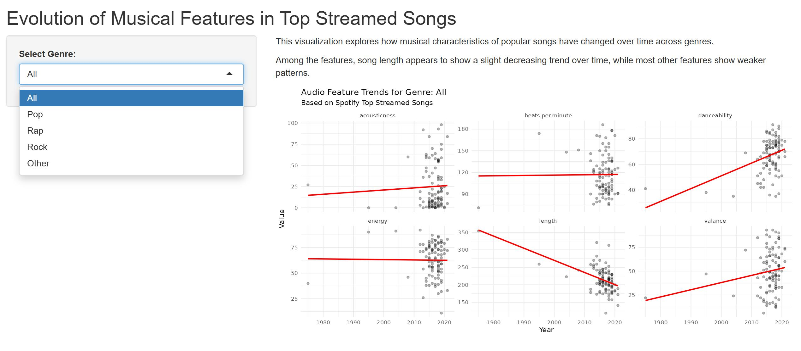
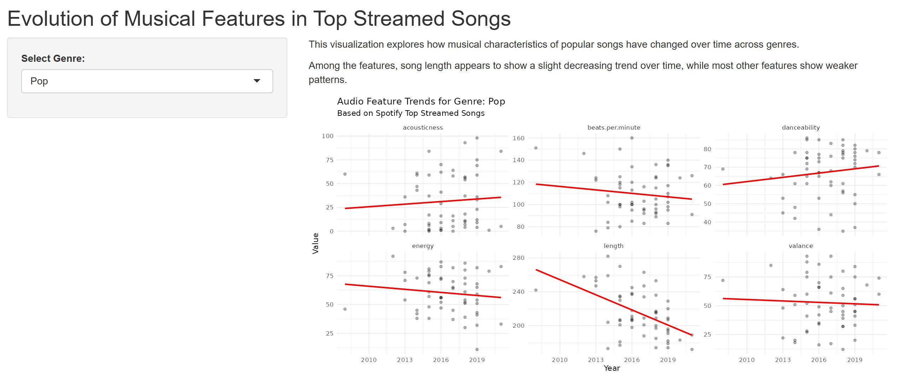

# Spotify Data Dashboard

An interactive Shiny dashboard for exploring trends in Spotify audio features over time.

## Demo
https://zijian-zou.shinyapps.io/hw03/

## Features
- Visualizes trends in audio features such as energy, danceability, and tempo  
- Allows interactive filtering by genre (Pop, Rap, Rock, etc.)  
- Compares patterns across different music categories  

## Tech Stack
- R  
- Shiny  
- ggplot2  
- dplyr  

## Data Source
Dataset sourced from Kaggle:  
[Top 100 Most Streamed Songs on Spotify](https://www.kaggle.com/datasets/pavan9065/top-100-most-streamed-songs-on-spotify)

Includes audio features such as energy, danceability, tempo, and valence.

## Insights
- Song length shows a slight decreasing trend over time  
- Most other audio features remain relatively stable  

## Future Improvements
- Improve UI/UX  
- Add more datasets  
- Expand feature analysis  

## Screenshots

### Overview (All Genres)

### Genre Filtering Example (Pop)

